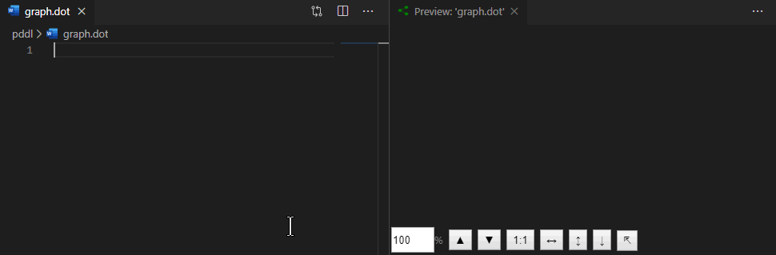

# Changes

## Version 0.0.6

- Fix for [Issue #15](https://github.com/joaompinto/vscode-graphviz/issues/15) related to incorrect syntax highlighting of comments lines starting with `#` character.
The [GraphViz language spec](https://www.graphviz.org/doc/info/lang.html) specifies that _a line beginning with a '#' character is considered a line output from a C preprocessor (e.g., # 34 to indicate line 34 )_.
- Fix for a regression of _open in browser_ functionality requested by [Issue #5](https://github.com/joaompinto/vscode-graphviz/issues/5). VS Code API to open a file in a browser changed behavior and only works for http URIs, not local files. The fix is re-introducing the `opn` dependency.
- Fix in the language snippet for Graphs and New Variables to correctly show a dropdown list of shape options.


## Version 0.0.5

- Add all shapes based on graphviz infosrc, closes #8

## Version 0.0.4

- fixed [Issue #5](https://github.com/joaompinto/vscode-graphviz/issues/5)
- replaced `opn` package dependency with new VS Code API to open the .svg file in a default application (e.g. browser)
- support for cross-extension integration

Other extensions may invoke the preview pane programmatically by writing a valid .dot file to the disk and then executing this command:

```javascript
commands.executeCommand('graphviz.preview', Uri.parse('/path/graph.dot'));
```

## Version 0.0.3: Precise zooming and export to .svg file

Released 2019-01-06

As per a popular request, an export to a file was added. Click the [🢥🗋] button and select the location of the .svg file. The file may be open in any web browser, or emailed...


It is also possible to open the file in the default browser by clicking on [🗔]. This creates a temp file and asks the operating system to open it in a default browser or another capable application.


The zoom level value may be now set to a specific value, or gradually changed by the up/down keys on the keyboard.


## Version 0.0.2: Scalable live preview

Released 2018-10-29

The live preview of the graph can now be:

- scaled up [▲],
- scaled down [▼],
- reset to 1:1 (one-to-one) scale,
- scaled to fit the width of the pane [↔] or
- scaled to fit the height of the pane [↕].

This greatly facilitates viewing large graphs.

To facilitate working on graph files in the editor, or visualizing files that are created by programs (i.e. search algorithms), the preview can be auto-scaled:

Double clicking on the fit-to-width [↔] or fit-to-height [↕] buttons toggles the given mode on, so when the graph source changes, the preview scales automatically to remain visible.


The extension was also upgraded to VS Code Webview API from the deprecated `vscode.previewHtml` command.

## Version 0.0.1: Graphviz support

Syntax highlighting, snippets and live preview.
