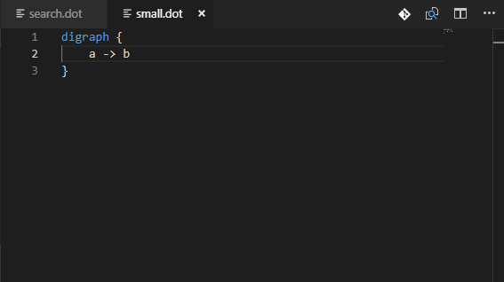

# Changes

## Version 0.0.2: Scalable live preview

Released 2018-10-29

The live preview of the graph can now be:

* scaled up [▲],
* scaled down [▼],
* reset to 1:1 (one-to-one) scale,
* scaled to fit the width of the pane [↔] or
* scaled to fit the height of the pane [↨].

This greatly facilitates viewing large graphs.

To facilitate working on graph files in the editor, or visualizing files that are created by programs (i.e. search algorithms), the preview can be auto-scaled:

Double clicking on the fit-to-width [↔] or fit-to-height [↨] buttons toggles the given mode on, so when the graph source changes, the preview scales automatically to remain visible.

The extension was also upgraded to VS Code Webview API from the deprecated `vscode.previewHtml` command.

## Version 0.0.1: Graphviz support

Syntax highlighting, snippets and live preview.
