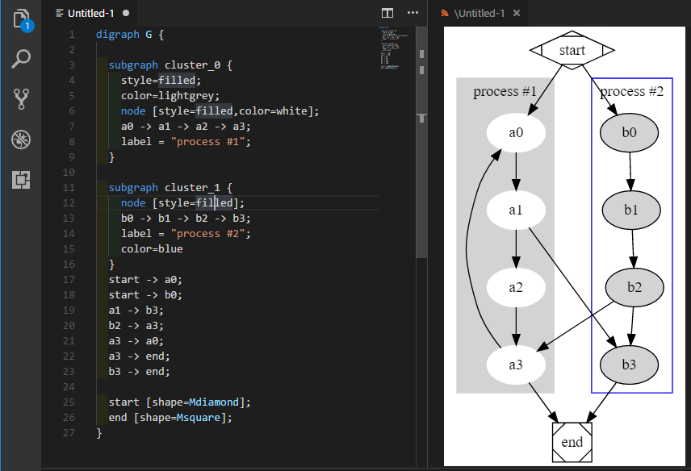
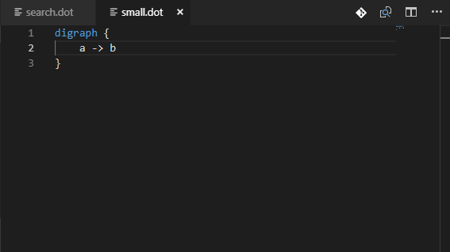
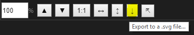

# Graphviz Support

[](https://marketplace.visualstudio.com/items?itemName=joaompinto.vscode-graphviz)
[](https://marketplace.visualstudio.com/items?itemName=joaompinto.vscode-graphviz)
[](https://vsmarketplacebadge.apphb.com/rating/joaompinto.vscode-graphviz.svg)

A vscode extension that provides language support and live preview for the Graphviz format.

The preview uses the [Viz.js](https://github.com/mdaines/viz.js/) library.

The extension can be activated in two ways

## Features

### Snippets

Try typing one of the following prefixes to see available snippets: `graph`, `>`, `var`, `dir`, `prop`, `path` or `rank` and efficiently create graphs, variables, properties, paths or ranks.

### Graph preview

* Toggle Preview - `ctrl+shift+v` (Mac: `cmd+shift+v`)
* Open Preview to the Side - `ctrl+k v` (Mac: `cmd+k shift+v`)



`ctrl+f` is supported to search for nodes/edges in large graphs, but it is best first to reset the scale to [1:1].

### Scaling the graph preview

The live preview of the graph can now be:

* scaled up [▲],
* scaled down [▼],
* reset to 1:1 (one-to-one) scale,
* scaled to fit the width of the pane [↔] or
* scaled to fit the height of the pane [↕].

This greatly facilitates viewing large graphs.

To facilitate working on graph files in the editor, or visualizing files that are created by programs (i.e. search algorithms), the preview can be auto-scaled:

Double clicking on the fit-to-width [↔] or fit-to-height [↕] buttons toggles the given mode on, so when the graph source changes, the preview scales automatically to remain visible.



The zoom level value may be now set to a specific value, or gradually changed by the up/down keys on the keyboard.


### Exporting to a .svg file

Click the [🢥🗋] button and select the location of the .svg file. The file may be open in any web browser, or attached to an email etc...



### Opening preview in a browser

It is also possible to open the file in the default browser by clicking on [🗔]. This creates a temp file and asks the operating system to open it in a default browser or another capable application.


Known issues:

* When VS Code window is re-sized, the auto-scaling does not kick-in as there is no VS Code event that we can listen to. Workaround: click the button again (the toggle state does not change).
* After the zoom percentage is set manually, the zoom value does no longer update when pressing other toolbar buttons. However, the display continues scaling as expected.

## For other extension developers

Other extensions may invoke the preview pane programmatically by writing a valid .dot file to the disk and then executing this command:

```javascript
commands.executeCommand('graphviz.preview', Uri.parse('/path/graph.dot'));
```

## How to install

Launch VS Code Quick Open (Ctrl+P), paste the following command, and press enter:

    ext install joaompinto.vscode-graphviz

## How to build and install from source (Linux)

```bash
git clone https://github.com/joaompinto/vscode-graphviz
cd vscode-graphviz
npm install
sudo npm install -g vsce typescript
vsce package
code --install-extension *.vsix
```

On Windows, just omit the `sudo` instruction.

## Credits

* The preview uses <https://github.com/mdaines/viz.js/> .
* The syntax highlight/snippets support is based on <https://github.com/Stephanvs/vscode-graphviz> .
